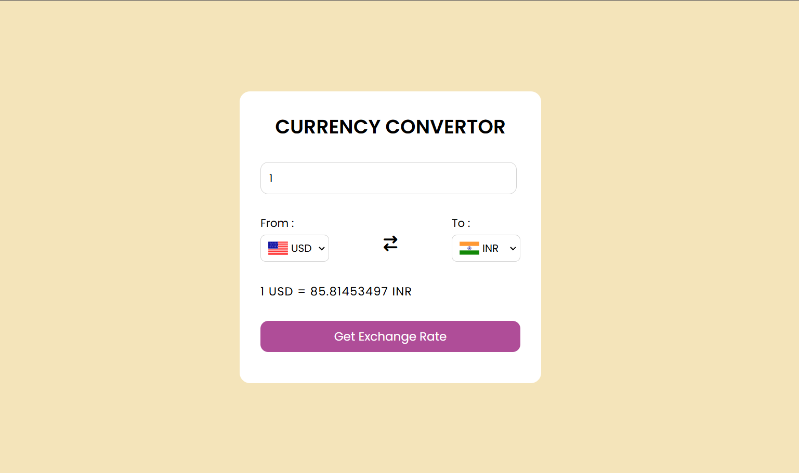

# Currency Converter

A **Currency Converter** web application that allows users to convert values between different currencies in real time. This project is built with HTML, CSS, and JavaScript, utilizing a currency exchange API for up-to-date conversion rates.

---

## Deployment

The project is live at: [Currency Converter](https://tonystark-19.github.io/Currency-convertor/)

## Screenshot

---

## Features

- Convert between multiple currencies.
- Real-time exchange rates.
- Simple and responsive UI for ease of use across all devices.
- Error handling for invalid inputs or network issues.
- **Deployed on GitHub Pages** for easy access and demonstration.

---

## Technologies Used

- **HTML**: For structuring the application.
- **CSS**: For styling and making it responsive.
- **JavaScript**: For implementing dynamic functionality.
- **API**: For fetching real-time exchange rates.
- **GitHub Pages**: For deployment.

---

## How to Use

1. **Enter the amount** you want to convert.
2. **Select the source currency** from the dropdown.
3. **Select the target currency** from the dropdown.
4. Click **Get Exchange Rate** to see the result.

---
